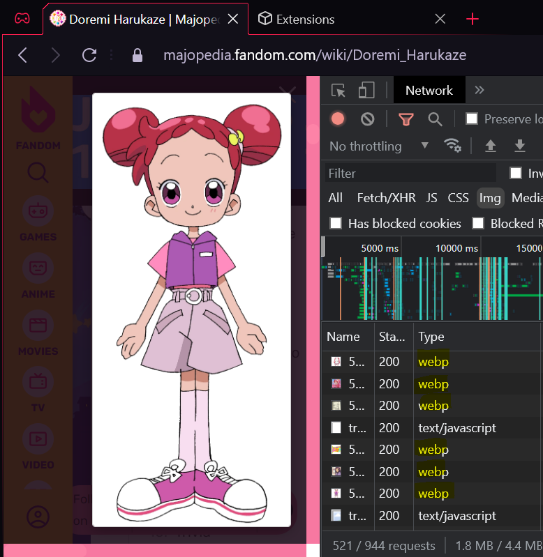
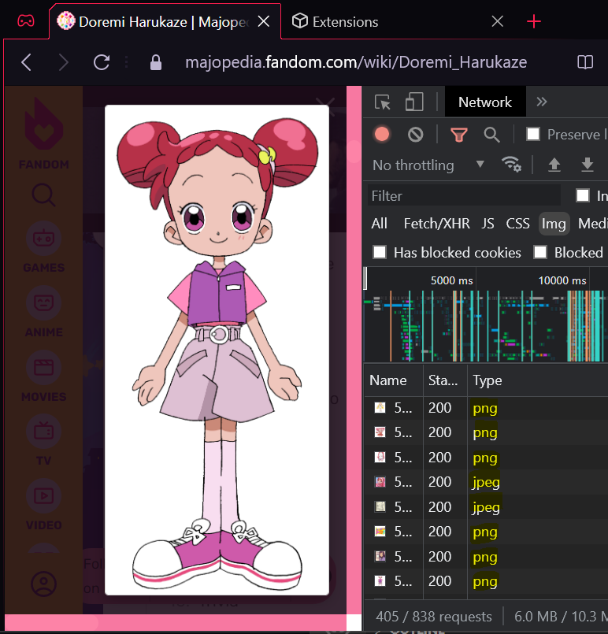

# WebPn't
Quick and dirty proof-of-concept extension that prevents you from seeing as many WebP (or AVIF) images in Chromium-based browsers. (If you are using Firefox or Librewolf, *disabling WebP in `about:config` is more effective.* This will still work, though. It has the advantage of not disabling WebP, so it won't *break* pages if they load WebP anyways.)

## How To Use
1. [Download this repository as a ZIP file.](https://github.com/jchv/webpnt/archive/refs/heads/master.zip)

2. Extract the ZIP file somewhere.

3. Go into your browser's Extensions page.

4. Enable "Developer mode" in the top right.

5. Select "Load unpacked extension"

6. Load the folder where the ZIP file was extracted to. (The folder you select needs to contain the `manifest.json` file.)

You *should* see that images from some sites like Fandom and Skeb (via Imgix) will load as PNG or JPEG instead of WebP in many circumstances. You can verify it in your browser's devtools network tab:

| Before | After |
|--|--|
|  |  |